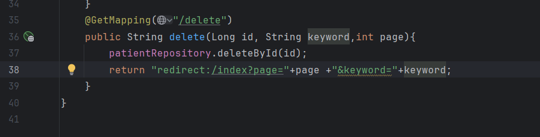

<h1>Application Web JEE basée sur Spring MVC, Thylemeaf et Spring Data JPA :</h1>

<h3>Architecture du projet :</h3>

<h3>Afficher les patients</h3>

<h3>Affichage des patients sur le web </h3>

<h3>Pagination :</h3>

<h3>Affichage sur le web avec pagination :</h3>

<h3>Chercher les patients :</h3>

<h3>Controller pour chercher :</h3>

<h3>Modification du Html pour la recherche :</h3>

<h3>Supression des Patients :</h3>
Bouton de suppression :

fonction de suppression :

